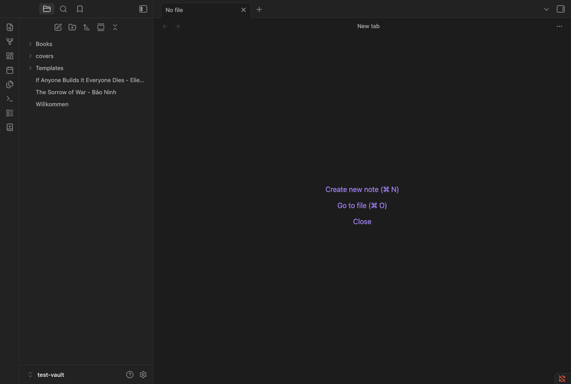
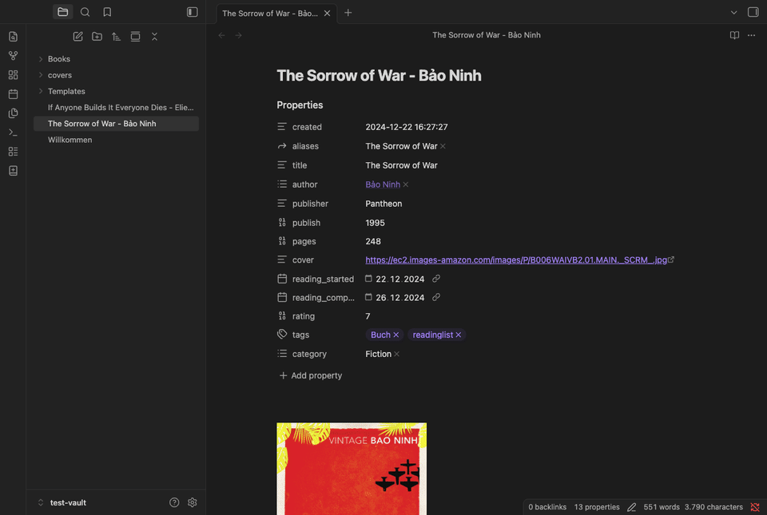

# Book Search + Covers

An Obsidian plugin for everyone who keeps their book library in their vault. Search as you type, pick the exact edition you mean, and get a finished book note from your own template, complete with a high resolution cover.

Covers are the heart of this plugin. Sharp, large images make a book library feel like a bookshelf, especially in gallery views (for example with [Obsidian Bases](https://obsidian.md/help/bases)). New notes get their cover straight from the search provider, requested in high resolution instead of the usual small thumbnail. The cover picker offers alternatives from both Google Books and Apple's catalog, whose artwork is often the crispest you can find.

## What it does (at a glance)

- **Live search.** Results appear while you type, with cover, title, author, year, and blurb. No multi-step dialogs that open and close; just type, see, pick.
- **High resolution covers.** Up to 800x800 pixels and beyond, instead of the small thumbnails most book plugins settle for.
- **Your template, your note.** Notes are created from a template you control, from the frontmatter properties down to the file name.
- **Covers as links or files.** Reference the cover by URL, or download it into your vault for a fully portable, offline library.
- **Backfill your existing library.** Give any book note a better cover, including notes you wrote by hand or created with another plugin.
- **Works on desktop and mobile.**

## Adding a new book

Find a new book and add it to your Obsidian library.



1. Click the book ribbon icon or run the **New book note** command.
2. Type a title, an author, or both. Results appear live. You can also paste an ISBN to jump straight to one exact edition.
3. Pick the edition you mean. The note is created from your template in your note folder and opens right away.

A few nice touches along the way: If a note for the book already exists you are asked first instead of ending up with a surprise duplicate. The store region and the cover storage mode defaults are defined in settings. They can be switched right in the search modal for that one search.

## Giving an existing note a better cover

Already have a library? Open any book note and run **Fetch or replace cover for current note**.



The plugin reads the note's `title` and `author` (from frontmatter, or the file name if there is none) and shows cover candidates from Google Books and Apple side by side. Each card tells you the title, author, year, source, and the actual pixel size it delivers, so you can pick the sharpest one at a glance. Found a better image somewhere else? Paste its URL into the field at the bottom and use that instead.

The chosen cover is written into the note's cover property (configurable), as a link or as a downloaded file, your choice. This works just as well for notes created by other plugins, which makes it a friendly way to upgrade a whole existing library one note at a time.

## Storing covers: link or download

- **Link (default).** The remote image URL is written into the note. Nothing is added to your vault, but rendering needs an internet connection.
- **Download into the vault.** The image is saved into a folder you choose and referenced locally. Portable, offline, and future-proof; roughly 140 KB per cover at 800x800.

You set a default in the settings and can override it per search in both modals.

## Customize new book notes

The built-in **Note template** works out of the box and is editable right in the settings. If you prefer managing templates as notes (e.g., leveraging the [Templater](https://github.com/SilentVoid13/Templater) plugin), point **Template file** at any note in your vault instead; a button next to the setting turns your current inline template into such a file so nothing is lost when you switch.

Templates use simple `{{variable}}` placeholders in the frontmatter and body. Even the file name is a template (default: `{{title}} - {{authors}}`).

<details>
<summary>All template variables</summary>

| Variable | What you get |
| --- | --- |
| `{{title}}` | Book title |
| `{{subtitle}}` | Subtitle, if any |
| `{{author}}` | First author |
| `{{authors}}` | All authors, comma-separated |
| `{{authorsYamlLinks}}` | Authors as a YAML list of `[[wikilinks]]` |
| `{{description}}` | Publisher's description (body only, too long for frontmatter) |
| `{{descriptionCallout}}` | Description as a collapsed callout; custom title via `{{descriptionCallout:My title}}` |
| `{{publisher}}` | Publisher name |
| `{{publishedDate}}` | Raw publish date, e.g. 2021-05-04 |
| `{{year}}` | 4-digit publish year |
| `{{pageCount}}` | Number of pages |
| `{{isbn}}` | ISBN-13, falling back to ISBN-10 |
| `{{isbn13}}` | ISBN-13 only |
| `{{isbn10}}` | ISBN-10 only |
| `{{categories}}` | Categories, comma-separated |
| `{{categoriesYamlList}}` | Categories as a YAML list |
| `{{language}}` | Language code, e.g. `en`, `de` |
| `{{seriesName}}` | Series name, if known |
| `{{seriesNumber}}` | Number within the series, if known |
| `{{source}}` | Search provider: `google` or `openlibrary` |
| `{{cover}}` | Cover URL or vault path, per the cover storage mode |
| `{{date}}` | Note creation date, YYYY-MM-DD |
| `{{datetime}}` | Note creation date and time, YYYY-MM-DD HH:mm:ss |

</details>

### Plays well with Templater

If you use Templater, the two get along nicely. The template file is a regular note in your vault, so it lives comfortably next to your Templater templates, and the plugin fills its `{{variables}}` on its own without needing Templater installed. With Templater's "Trigger Templater on new file creation" enabled, your Templater commands in the template run on the new note as usual.

## Getting started

1. Install **Book Search + Covers** from Obsidian's Community plugins and enable it.
2. Optional but recommended: add a free **Google Books API key** for the richest metadata. The [step-by-step guide](https://github.com/lksrpp/obsidian-book-search-covers/blob/main/docs/google-books-api-key.md) takes about 5 minutes and requires no billing. Without a key, search uses Open Library, which works fine but with a smaller catalog and returns leaner metadata.
3. Have a look at the settings: pick your note folder, your store region, and how covers should be stored. The defaults are sensible, so feel free to just start searching.

## Network use and privacy

The plugin talks to `googleapis.com` (with your API key), `itunes.apple.com`, and `openlibrary.org` to fetch book data and covers. Your API key is stored locally in the plugin's `data.json` and is never sent anywhere except Google. No telemetry, no tracking.

## Thanks

- [Templater](https://github.com/SilentVoid13/Templater), the gold standard for templating in Obsidian.
- [Book Search](https://github.com/anpigon/obsidian-book-search-plugin), the plugin that planted the idea. If you want a different take on book notes, give it a look.
- Book data comes from Google Books and Open Library, covers from Google Books and Apple's iTunes Search API.

## Development

```bash
npm install
npm run dev     # watch build -> main.js
npm run build   # typecheck + production build
npm run lint    # eslint-plugin-obsidianmd
npm test        # vitest
```

Built with the standard Obsidian + esbuild toolchain.

## License

MIT
